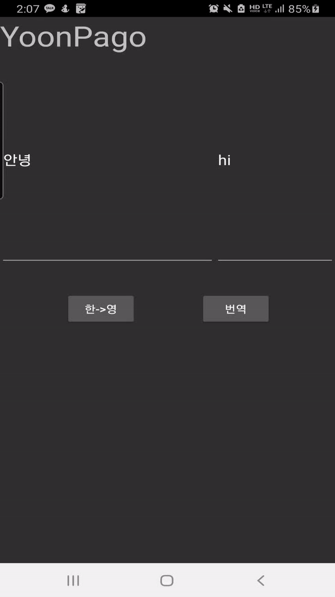

# papago api test

## 파파고 api 테스트 & json 가져오기 연습 





파파고 api : https://developers.naver.com/docs/nmt/reference/#papago-nmt-api-reference


#### 파파고 api의 요청 변수

```
POST /v1/papago/n2mt HTTP/1.1
HOST: openapi.naver.com
User-Agent: curl/7.49.1
Accept: */*
Content-Type: application/x-www-form-urlencoded; charset=UTF-8
X-Naver-Client-Id: {애플리케이션 등록 시 발급받은 client id 값}
X-Naver-Client-Secret: {애플리케이션 등록 시 발급받은 client secret 값}
srcLangType		:source language
tarLangType		:target language
translatedText	:	번역된 text
```

#### 파파고 api의 출력 변수

```json
srcLangType	string	source language
tarLangType	string	target language
translatedText	string	번역된 text
```

#### 하지만 response되는 json이 이런구조를 가지고있어

```json
{
    "message": {
        "@type": "response",
        "@service": "naverservice.labs.api",
        "@version": "1.0.0",
        "result": {
            "translatedText": "tea"
        }
    }
}
```

#### response 클래스를 이렇게 구성

```kotlin
class TranslateResponse {  //처음 들어오는 구성
    @SerializedName("message") //메시지
    val message : Translatemessage? =null   }
class Translatemessage{
    @SerializedName("type") //@type
    val type : String? =null
    @SerializedName("service") //@service
    val service: String? = null
    @SerializedName("version") //@version
    val version: String? = null
    @SerializedName("result")	//result
    val result:Messageresult? =null    }
class Messageresult{  //result
    @SerializedName("srcLangType")
    val srcLangType : String? =null
    @SerializedName("tarLangType")
    val tarLangType: String? = null
    @SerializedName("translatedText")
    val translatedText: String? = null    }
```

#### 번역 수행 함수 구성

```kotlin
fun translate(targettext:String){
        if(targettext==""){ // 비어있을때는 변역이 되지 않으므로 
            after_text.setText("")
            return
        }
        var callPostTransferPapago = api.transferPapago(RetrofitClient.CLIENT_ID, RetrofitClient.CLIENT_SECRET, if(koToen) "ko" else "en", if(koToen) "en" else "ko", targettext ) // 각각 파파고 api 요청변수

        callPostTransferPapago.enqueue(object : Callback<TranslateResponse?> { 
            override fun onResponse( 
                call: Call<TranslateResponse?>, 
                response: Response<TranslateResponse?>
            ) {
                val result = response.body()
                if (result != null) {
                    var Translated_text= result.message?.result?.translatedText 
                    				// result 안에안에 있는 변역된 문장 저장
                    after_text.setText(Translated_text)
                    Log.d("TAG", "성공 :,$targettext -> ${Translated_text}")
                }
            }
            override fun onFailure(call: Call<TranslateResponse?>, t: Throwable) {
                Log.d("TAG", "실패 : $t")
            }
        })

    }
```


